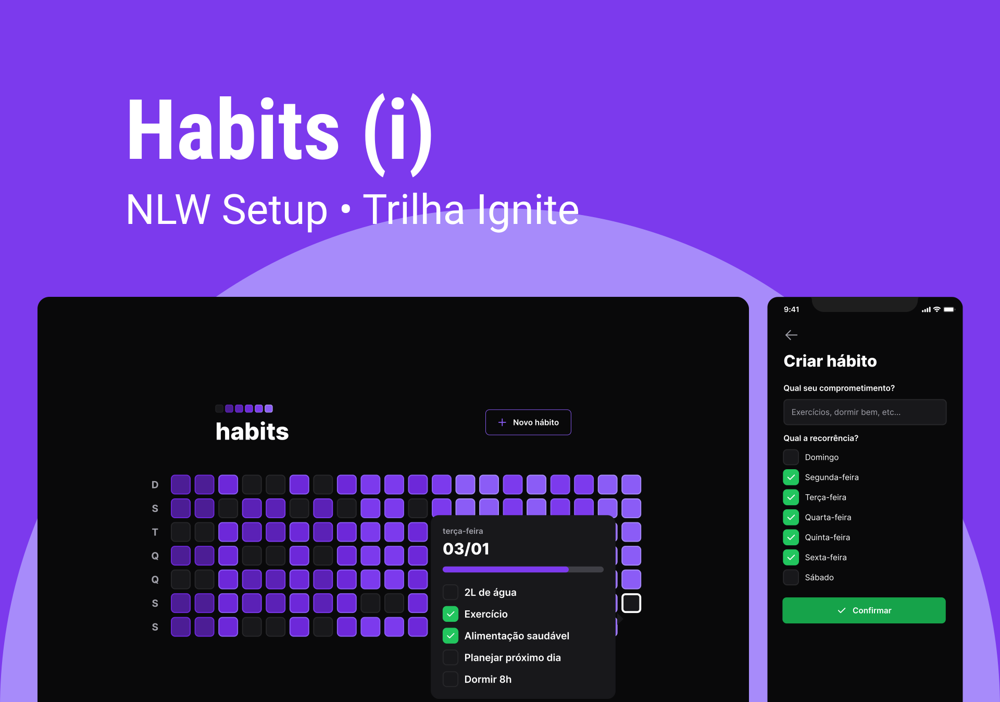

<p align="center">
      
</p>

<h1 align="center">[NLW Setup] Mission: Ignite</h1>

<h2 align="center">Tópicos 📋</h2>

   <p>
   
   - [Sobre 📖](#sobre-)
   - [Layout 🎨](#layout-)
   - [Tecnologias 🛠️](#Tecnologias-)
   - [Arquivos no Notion 📋](#arquivo-no-notion-)
   - [Primeiros Passos 🚀](#primeiros-passos-)
   - [Como Contribuir 💪](#como-contribuir-)
   - [Licença 📝](#licença-)

   </p>

---

<h2 align="center">Sobre 📖</h2>
<p align="center">
   Esse projeto foi desenvolvido na Next Level Week Setup, em uma semana intensa de estudos, acompanhado de um projeto desenvolvido pela Rocketseat do dia 16 ao dia 23 de Janeiro de 2023.<br>
   Essa aplicação consiste em um sistema Web e Mobile para gestão de hábitos. <br>

</p>
 
---

<h2 align="center">Layout 🎨</h2>

   <p align="center">
      
   </p>

   <p align="center">
      O Layout desenvolvido por <a href="https://www.figma.com/@rocketseat">Rocketseat</a>, para acessar no Figma:
   
   - <a href="https://www.figma.com/community/file/1195326661124171197">Missão Ignite</a> 🚀
   </p>

---   

<h2 align="center">Tecnologias 🛠️</h2>

   <p>

- [NodeJS](https://nodejs.org/)
- [ReactJS](https://reactjs.org/)
- [TypeScript](https://www.typescriptlang.org)
- [TailWindCSS](https://tailwindcss.com)
- [React native](https://reactnative.dev/)
- [Expo](https://expo.dev/)
- [Prisma](https://www.prisma.io)
- [Fastify](https://www.fastify.io)
- [ViteJS](https://www.vitejs.dev)

   </p>

---

<h2 align="center">Arquivo no Notion 📋</h2>

- [Missão Ignite](https://efficient-sloth-d85.notion.site/NLW-11-Setup-4a8623c9e0bf415dbd5fdbe79f387a6e) 🚀


---

<h2 align="center">Primeiros Passos 🚀</h2>

   ```
   - Clone o projeto 

   $ git clone https://github.com/ErickSilva2605/rocketseat-nlw-setup.git
   $ cd nlw-setup-ignite
   ```

   ### Web
   ```
   # Instalar as dependências
   $ cd web
   $ npm install

   # Inicia o projeto
   $ npm start
   ```

   ### Server
   ```
   # Instalar as dependências
   $ cd server
   $ npm install

   # Inicia o projeto
   $ npx prisma migrate deploy
   $ npm run dev
   ```

   ### Mobile
   ```
   # Instalar as dependências
   $ cd mobile
   $ npm install

   # Inicia o projeto
   $ npx expo start
   ```

---

<h2 align="center">Como Contribuir 💪</h2>

   ```
   - Clone o projeto 

   - Cria uma nova branch com suas mudanças:
   $ git checkout -b my-feature

   - Salve suas mudanças e crie uma mensagem de commit falando o que fez:
   $ git commit -m "feature: My new feature"

   - Envie suas mudanças:
   $ git push origin my-feature
   ```

---

<h2 align="center">Licença 📝</h2>

<p align="center">
   Este repositório está sob licença MIT. Você pode ver o arquivo <a href="https://github.com/ErickSilva2605/rocketseat-nlw-setup/blob/main/LICENSE">LICENSE</a> para mais detalhes.
</p><br>

---


   >Esse projeto foi desenvolvido por **[@Erick Augusto](https://www.linkedin.com/in/erick-augusto-silva/)**, com os instrutores da **[Rocketseat](https://rocketseat.com.br/)**, na #NextLevelWeekSetup.<br>
   Se isso te ajudou, dê uma ⭐, isso vai me ajudar também! 😉

---

<br>
<div align="center">

   [](https://www.linkedin.com/in/erick-augusto-silva/)

</div>